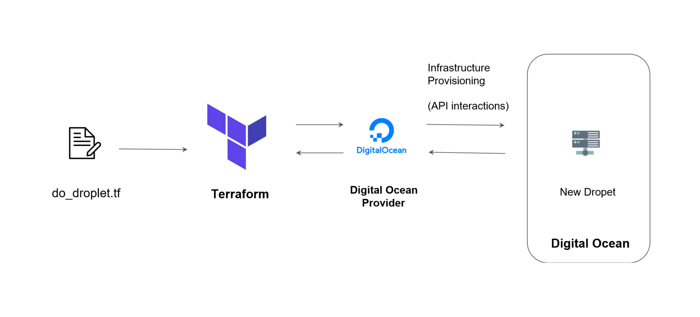
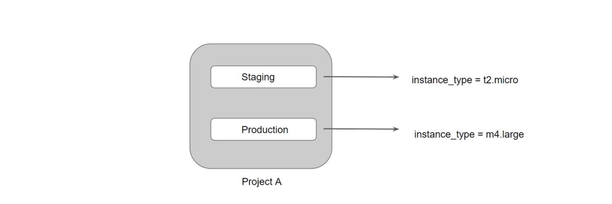

# What is it?

This project holds my study notes studying for [HashiCorp Certified: Terraform Associate](https://www.hashicorp.com/certification/terraform-associate).
It's also a small set of hacks to learn common use cases with [Hashicorp](https://www.hashicorp.com/)
's [Terraform](https://www.terraform.io/) :building_construction: :cloud:.

## What is Terraform?

Terraform is a tool for building, changing, and versioning infrastructure safely and efficiently.
Terraform can manage existing and popular service providers as well as custom in-house solutions.

Configuration files describe to Terraform the components needed to run a single application or your
entire datacenter. Terraform generates an execution plan describing what it will do to reach the
desired state, and then executes it to build the described infrastructure. As the configuration
changes, Terraform is able to determine what changed and create incremental execution plans which
can be applied.

The infrastructure Terraform can manage includes low-level components such as compute instances,
storage, and networking, as well as high-level components such as DNS entries, SaaS features, etc.

## Infrastructure as Code (IaC)
Infrastructure is described using a high-level configuration syntax. This allows a blueprint of your
datacenter to be versioned and treated as you would any other code. Additionally, infrastructure can
be shared and re-used.

### Configuration Management vs Infrastructure Orchestration

Ansible, Chef, Puppet are configuration management tools which means that
they are primarily designed to install and manage software on existing
servers.

Terraform, CloudFormation are the infrastructure orchestration tools
which basically means they can provision the servers and infrastructure
by themselves.

### Benifits of IaC

- Automation
- Versioning
- Reusability

## Terraform Providers

A provider is responsible for understanding API interactions and exposing resources.

Most of the available providers correspond to one cloud or on-premises infrastructure platform, and
offer resoure types that correspond to each of the features of that platform.

You can explicitly set a version of the provider within the provider block.

To upgrade to the latest acceptable version of each provider, run `terraform init -upgrade`.

Each Terraform provider module must declare which providers it requires, so that Terraform can
install and use them.

Provider requirments are declared in a `required_providers` block.

```hcl
terraform {
  required_providers {
    mycloud = {
      source  = "mycorp/mycloud"
      version = "~> 1.0"
    }
  }
}
```

## Provider Architecture



You can have multiple provider instance with the help of alias.

```hcl
provider "aws" {
  region = "us-east-1"
}

provider "aws" {
  alias  = "west"
  region = "us-west-1"
}
```

## Terraform Commands

The provider block without alias set is known as the default provider configuration. When an alias
is set, it creates an additional provider configuration.

- ### Terraform init

  The Terraform `init` command is used to initialize a working directory containing Terraform
  configuration files.

  During init, the configuration is searched for module blocks, and the source code for referenced
  modules is retrieved from the locations given in their source arguments.

  Terraform must initialize the provider before it can be used.

  Initialization downloads and installs the provider's plugin's plugin so that it can be later be
  executed.

  It will not create any sample files like example.tf

- ### Terraform plan

  The Terraform `plan` command is used to create an execution plan.

  It will not modify thinfs in infrastructure.

  Terraform performs a refresh, unless explicitly disabled, and then determines what actions are
  necessary to achieve the desired state specified in the configuration files.

  This command is a convenient way to check whether the execution plan for a set of changes matches
  your expectations without making any changes to real resources or to the state file.

- ### Terraform apply

  The Terraform `plan` command is used to apply the changes required to reach the desired state of the
  configuration.

  Terraform apply will also write data to the terraform `.tfstate` file.

  Once apply is completed, resources are immediately available.

- ### Terraform Destroy

  The Terraform `destroy` command is used to destroy the Terraform managed infrastructure.

  `terraform destroy` command is not the only command through which infrastructure can be destroyed.

  `terraform plan -destroy` can be used to preview destroy plan.

- ### Terraform refresh

  The Terraform `refresh` command is used to reconcile the state Terraform knows about )via its state
  file) with real-world infrastructure.

  This does not modify infrastructure but does modify the state file.

- ### Terraform format

  The `terraform fmt` command is used to rewrite Terraform configuration files to a canonical format
  and style.

  For use-case, where all configuration written by team members needs to have a proper style of code,
  `terraform fmt` can be used.

- ### Terraform validate

  The `terraform validate` command validates the configuration files in a directory.

  Validate runs checks that verify whether a configuration file is syntactically valid and thus
  primarily useful for general verification of reusable odules, including the correctness of attribute
  names and value types.

  It is safe to run this command and automatically, for example, as a post save check in a text editor
  or as a step for reusable modules in a CI system. It can be run before `terraform plan`.

  Vaidation requires an initalized working directory with any referenced plugins and modules
  installed.

- ### Terraform Graph

  The `terraform graph` command is used to generate a visual representatio of either a configuration
  or execution plan.

  The output of `terraform graph` is in the `DOT format`, which can easily be converted to an image.

- ## Terraform taint

  The Terraform `taint` command manually marks a Terraform managed resource as tainted, forcing it
  to be destroyed and recreated on the next apply.

  Once a resource is marked as tainted, the next plan will show that the resource will be destroyed
  and recreated and the next apply will implement this change.

  Terraform `taint` can also be used to taint resources within a module.

  Example:

  `terraform taint [options] address`

  For multiple sub modules, the following syntax bases exaple can be used.

  `terraform taint "module.foo.module.bar.aws_instance.qux"`

- ## Terraform state

  Rather than modify the state directly, the terraform state commands can be used in many cases
  instead.

  - `terraform state list` - List resources within terraform state
  - `terraform state mv` - Move items within terraform state. Can be used for resource renaming.
  - `terraform state pull` - Manually download and output the state from state file.
  - `terraform state rm` - Remove items from within state file.
  - `terraform state show` - Show attributes of a single resource in the terraform state.

## Terraform Provisioners

Provisioners can be used to model specific actions on the local machine or on a remote machine in
order to prepare servers or other infrastructure objects for service.

Provisioners should only be used as a last resort. For common situations, there are better
alternatives.

To persist logged output you can set `TF_LOG_PATH`.

### Terraform Provisioners Types

- `local-exec` - This provisioner type invokes a local executable after a resource is created. This
  invokes a process on the maching running Terrafrom, not on the resource.

  Example:

  ```hcl
  resource "aws_instance" "web" {
    provisioner "local-exec" {
      command = "echo ${aws_instance.web.private_ip} >> private_ips.txt
    }
  }
  ```

- `remote-exec` - This provisioner type invokes a script on a remote resource after it's created.

  The `remote-exec` provisioner supports both ssh and winrm type connections.

  Example:

  ```hcl
  resource "aws_instance" "web" {
    provisioner "remote-exec" {
      inline = [
        "yum -y install nginx"
        "yum -y install nano"
      ]
    }
  }
  ```

### Terraform Run Time Types

- Creation-Time Provisoners - creation-time provisoners are only run during creation, not during
  updating or any other lifecycle.

  If a creation-time provisoner fails, the resource is marked as tainted.

- Destroy-Time Provisioners - Destroy provisoners are run before the resource is destroyed.

### Provisoner Failure Behavior

By default, provisioners that fail will also cause the Terraform apply itself to fail.

The `on_failure` setting can be used to change this. The allowed values are:

- `continue` - Ignore the error and continue with creation or destruction
- `fail` - Raise an error and stop applying (the default behavior). If this is a creation
  provisoner, taint the resource.

## Terraform Import

Terraform is able to import existing infrastructure.

This allows you to take resources that you've created by some other means and bring it under
Terraform management.

The current implementation of Terraform imports can only import resources into the state. It does
not generate configuration.

Because of this, prior to running terraform import, it is necessary to write a resource
configuration block manually for the resource, to which the imported object will be mapped.

Example `terraform import aws_instance.myec2 instance-id`

## Terraform Variables

The value associated with a variable can be assigned via multiple ways including assigning a default
value in the `.tf` file, via the CLI, or via a `.tfvars` file.

The order Terraform loads variables is:

1. Environment variables
2. The `terraform.tfvars` file if present
3. The `terraform.tfvars.json file if present
4. Any `*.auto.tfvars` or `*.auto.tfcars.json` files processed in lexical order of thier filenames
5. Any `-var` and `-var-file` options on the command line, in the order they are provided

If the same variable is assigned multiple values, Terraform uses the last value it finds.

### Blacklisted variable names

- `count`
- `depends_on`
- `for_each`
- `lifecycle`
- `providers`
- `source`

## Terraform Comments

Terraform supports these types of comments:

```hcl
#
//
/* and */
```

## Local Values

A local value assigns a name to an expression, allowing it to be used multiple times within a module
without repeating it.

The expression of a local value can refer to other locals, but as usual reference cycles are not
allowed. That is, a local cannot refer to itself or to a variable that refers (directly or
inderectly) back to it.

It's recommended to group together logically related values into a single block, particularly if
they depend on each other.

## Debugging in Terraform

Terraform has detailed logs that can be enabled by setting the `TF_LOG` environment variable to one
of `TRACE`, `DEBUG`, `INFO`, `WARN`, `ERROR` to chnage the verbosity of the logs.

## Terraform Data Types

- `string` - Sequence of Unicode characters representing some text like `hello`.
- `list` - Sequential list of values identified by their position. Starts with 0.
Example: `["red", "blue", "green"]`
- `map` - A group of values identified by named labels. Example: `{name="foo", age=42}`
- `number` Example `200`

## Terraform Data Source Code

Data sources allow data to be fetched or computed for use elsewhere in Terraform configuration.

Reads from a specific data source (aws_ami) and exports results under "app_ami"

## Fething Values from Map

To reference to image-abc from the below map, following approaches needs to be used:

```hcl
var.ami_ids["mumbai"]
```

```hcl
variable "ami_ids" {
  type    = map
  default = {
    "mumbai"  = "image-abc"
    "germany" = "image-def"
    states    = "image-xyz"
  }
}
```

## Structural Data Types

A structural type allows multiple values of several distinct types to be grouped together as a
single value.

List contains multiple values of different type.

## Terraform Variables with undefined values

If you have variables with undefined values, it will not directly result in an error.

Terraform will ask you to supply the value associated with them.

## Environment Variables

Environment variables can be used to set variables.

The environment variables must be in the format of `TF_VAR_name` Example:

```sh
export TF_VAR_region=us=east-1
export TF_VAR_my_list='[1,2,3]'
```

## Terraform Workspaces

Terraform allows us to have multiple workspaces; with each of the workspaces, we can have a
different set of environment variables associated.

Workspace allow for multiple state files of a single configuration.

Workspaces are managed with the `terraform workspace` set of commands.

State File Directory = `terraform.tfstate.d`

Not suitable for isolation for strong seperation between workspace (stage/ prod)



## Terraform Modules

We can centralize the Terraform resources and can call out from TF files whenever required.

## Terraform Module Sources

The module installer supports installation from a number of different source types like Local paths,
Terraform Registry, GitHub, S3, buckets and others.

Local path references allow for factoring out portions of a configuration within a single source
repository.

A local path must begin with either `./` of `../` to indicate that a local path is intended.

### Understanding Root and Child

Every Terraform configuration has at least one module, known as its root module, which consists of
the resources defined in the `.tf` files in the main working directory.

A module can call other modules, which lets you include the child module's resources into the
configuration in a concise way.

A module that includes a module block like this is the calling module of a child module.

```hcl
module "servers" {
  source = "./app-cluster"
  servers = 5
}
```

### Accessing output values

The resources defined in a module are encapsulated, so the calling module cannot access their
attributes directly.

However, the child module can declare output values to selectively export certian values to be
accesses by the calling module.

```hcl
output "instance_ip_address" {
  value = aws_instance.server.private_ip
}
```

## Supressing values in CLI output

An output can be marked as containing sensitive material using the optional `sensitive` argument.

```hcl
output "instance_ip_address" {
  value       = aws_db_instance.database.password
  description = "The password for the logging into the database"
  sensitive   = true
}
```

Setting an output value in the root module as sensitive prevents Terraform from showing its value in
the list of outputs at the end of a `terraform apply`

Sensitive output values are still recorded in the state, and so will be visable to anyone who is
able to access the state data.

## Module Versions

It is recomended to explicitly constraint the acceptable version numbers for each external module to
avoid unexpected or unwanted changes.

Version constraints are supported only for module installed from a module registry, such as the
Terraform Registry or Terraform Cloud's private module registry.

```hcl
module "consul" {
  source  = "hashicorp/consul/aws"
  version = "0.0.5"
  servers = 3
}
```

## Terraform Registry

The Terraform Registry is intregrated directly into Terraform.

The syntax for refrencing a registry module is `<NAMESPACE>/<NAME>/<PROVIDER>`. For example:
`hashicord/consul/aws`.

```hcl
module "consul" {
  source  = "hashicorp/consul/aws"
  version = "0.1.0"
}
```

### Private Registry for Module Sources

You can also use modules from a private registry, like the one provided by Terraform Cloud.

Private registry modules have source strings of the following form: `<HOSTNAME>/<NAMESPACE>/<NAME>/<PROVIDER>`.

This is the same format as the public registry but with an added hostname prefix.

While fetching a module, having a version is required.

```hcl
module "consul" {
  source  = "app.terraform.io/example_corp/vpc/aws"
  version = "0.1.0"
}
```

## Terraform Functions

The [Terraform language includes a number of built-in functions](https://www.terraform.io/docs/language/functions/)
that you can use to transform and combine values.

```hcl
max(5, 12, 9)

12
```

The Terraform language does not support user defined functions, and so the only functions built into
the language are available for use.

Be aware of basic functions like `element`, `lookup`.

## Count and Count Index

The `count` parameter on resources can simplify configurations and let you scale resources by simply
incrementing a number.

In resource blocks where the count is set, an additional count object (`count.index`) is avai;able
in expressions, so that you can modify the configuration of each instance.

```hcl
resource "aws_iam_user" "load blancer" {
  name  = "loadbalancer.${count.index}"
  count = 5
  path  = "/system/"
}
```

## Terraform Lock

If supported by your backend, Terraform will lock your state for all operations that could write
state.

Terraform has a force-unlock command to manually unlock the state if unlocking failed.

Unlock Example: `terraform force-unlock LOCK_ID [DIR]`

## Resource Block

Each resource block describes one or more infrastructure objects, such as virtual networks, compute
instances, or higher level components such as DNS records.

A resource block declares a resource of a given type ("aws_instance") with a given local name
("web").

```hcl
resource "aws_instance" "web" {
  ami           = "ami-1234567890
  instance_type = "t2.micro"
}
```

## Sentinel

Sentinel is an embedded policy as code framework intgrated with the Hashicorp Enterprise products.

Can be used for various use cases like:

- Verify if EC2 instance has tags
- Verify if the S3 bucket has encryption enabled

Sentinel is a proactive service.

### Terraform Flow

`terraform plan` -> Sentinel Checks -> `terraform apply`

## Sensitive Data in State File

If you manage any sensitive data with Terraform (like database passoword, user passwords, or private
keys), treat your state itself as sensitive data.

Approaches in such a scenario:

Terraform Cloud always encrypts the state at rest and protects it with TLS in transit. Terraform
Cloud also knows the identity of the user requesting state and maintains a history of state changes.

The S3 backend supports encryption at rest when the encrypt option is enabled.

## Dealing With Credentials in Config

Hard-coding credentials into any Terraform configuration are not recomended, and risks the secret
leakage should this file ever be commited to a public version control system.

You can store the credentials outside of terraform configuration.

Storing credentials as part of environment variables is also a much better approach than hard coding
it in the system.

## Backend Configuration

Backends are configured directly in Terraform files in the Terraform section.

After configuring a backend, it has to be initialized.

### Terraform Local Backend

The localbackend stores state on the local filesystem, locks that state using system APIs, and
performs opperations locally.

By default, Terraform uses the "local" backend, which is the normal behavior of Terraform you're
used to.

### Backend Configuration Types

- #### First time configuration

  When configuring a backend for the first time (moving from no defined backend to explicitly
  configuring one), Terraform will give you the option to mitgrate your state to the new backend.

  This lets you adopt backends without losing any existing state.

- #### Partial time configuration

  You do not need to specify every required argument in the backend configuration. Omitting certian
  arguments may be desirable to avoid storing secrets, such as keys, within the main configuration.

  With a partial configuration, the remaining configuration arguments must be provided as part of
  the initialization process.

## Remote Backend for Terraform Cloud

The remote backend stores Terraform state and may be used to run operations in Terraform Cloud.

When using full remote operations, operations like `terraform plan` or `terraform apply` can be
executed in Terraform Cloud's run environment, with log output streaming to the local terminal.

## Splat Expressions

Splat expressions allows us to get a list of all attributes.

```hcl
resource "aws_instance" "load_balancer" {
  name  = "iamuser.${count.index}"
  count = 3
  path  = "/system/"
}

output "arns" {
  value = aws_iam)user.load_balancer[*].arn
}
```

## Terraform Terminologies

Given this example:

```hcl
resource "aws_instance" "example" {
  ami = "123"
}
```

`aws_instance` - Resource type
`example` - Local name for the resource
`ami` - Argument name
`123` - Argument value

## Provider Configuration

Provider Configuration block is not mandatory for all terraform configuration.

### Terraform Output

The `Terraform output` command is used to extract the value of an output variable from the state
file.

## Terraform Enterprise & Terraform Cloud

Terraform Enterprise provides several advantages compared to Terraform Cloud including:

- Single Sign On
- Auditing
- Private Data Center Networking
- Clustering

Team & Governance features are not available for Terraform Cloud free

## Required Version

The `required_version` setting accepts a version contraint string, which specifies which versions of
Terraform can be used with your configuration.

If the running version of Terraform doesn't match the constraints specified, Terraform will produce
an error and exit without taking any further actions.

Example:

```hcl
terraform {
  required_version = "> 0.12.0"
}
```

## Versioning Arguments

There are multiple ways for specifying the version of a provider.

- `>=1.0` - Greater than equal to the version
- `<=1.0` - Less than equal to the version
- `~>2.0` - Any version in the 2.X range
- `>=2.10, <=2.30` - Any version between 2.10 and 2.30

## Terraform and Git

If you are using a Git repository for commiting terraform code, the `.gitignore` should be
configured to ignore certian terraform files that might contain sensitive data. Some examples of
files that could contain sensitive data are:

- `terraform.tfstate` file
- `*.tfvars`

Arbitrary Git repositories can be used by prefixing the address with the special `git ::` prefix.

After this prefix, any valid Git URL can be specified to select one of the protocols supported by
Git.

Example:

```hcl
module "vpc" {
  source = "git::https://example.com/vpc.git"
}

module "storage" {
  source = "git::https://example.com/storage.git"
}
```

BY default Terraform will clone and use the default branch (referenced by `HEAD`) in the selected
repository.

You can override this using the ref argument. The value of the ref argument can be any reference
that would be accepted by the git checkout command including branch and tag names.

Example:

```hcl
module "vpc" {
  source = "git::https://example.com/vpc.git?ref=v1.2.0"
}
```

## Depenency Types

- ### Implicit

  With implicit dependency, Terraform can automatically find references of the object, and create an
  implicit ordering requirement between the two resources.

  Example:

  ```hcl
  resource "aws_eip" "my_eip" {
    vpc = true
  }

  resource "aws_instance" "my_ec2" {
    instance_type = "t2.micro"
    public_ip     = aws_eip.my_eip.private_ip
  }
  ```

- ### Explicit

  Explicitly specifying a dependency is only necessary when a resource relies on some other
  resource's behavior but doesn't access any of that resource's data in its arguments.

  ```hcl
  resource "aws_s3_bucket" "example" {
    acl = private
  }

  resource "aws_instance" "my_ec2" {
    instance_type = "t2.micro"
    depends_on    = [aws_s3_bucket.example]
  }
  ```

## Dealing with Larger Infrastucture

Cloud providers have certain amount of rate limiting set so Terraform can only request certain
amount of resources over a period of time.

It is important to break larger configurations into multiple smaller configurations that can be
independently applied.

Alternatively, you can make use of `-refresh=false` and target flag for a workaround (not
recommended).

## Requirements for publishing modules in the Terraform registry

1. The module must be on GitHub and must be a public repo. This is only a requirement for the public
registry. If you're using a private registry, you may ignore this requirement.
2. Module repositories must use this three-part name format, where <NAME> reflects the type of
infrastructure the module manages and <PROVIDER> is the main provider where it creates that
infrastructure. The <NAME> segment can contain additional hyphens. Examples:
`terraform-google-vault` or `terraform-aws-ec2-instance`.
3. The GitHub repository description is used to populate the short description of the module. This
should be a simple one sentence description of the module.
4. The module must adhere to the [standard module structure](https://www.terraform.io/docs/language/modules/develop/structure.html).
This allows the registry to inspect your module and generate documentation, track resource usage,
parse submodules and examples, and more.
5. The registry uses tags to identify module versions. Release tag names must be a semantic version,
which can optionally be prefixed with a v. For example, v1.0.4 and 0.9.2. To publish a module
initially, at least one release tag must be present. Tags that don't look like version numbers are
ignored.

## Miscellaneous Pointers

Terraform does not require go as a prerequisite.

It works well in Windows, Linux, and Mac.

Windows Server is not mandatory.

`slice` function is not part of the string function. Others like `join`, `split`, `chomp` are part
of it.

It is not mandatory to include the module version argument while pulling code from terraform
registry.

Overuse of dynamic blocks can make configuraton hard to read and maintain.

Terraform apply can change, destroy, and provision resources but cannot import any resource.

`lookup` retrieves the value of a single element from a map.

Various commands runs terraform refresh implicitly, some of these include:

- `terraform plan`, `terraform apply`, `terraform destroy`
- Others like `terraform init` and `terraform import` do not run refresh implictly

Array Datatypes is not supported in Terraform

Various variable definition files will be loaded automatically in terraform. These inlcude:

- `terraform.tfvars`
- `terraform.tfvars.json`
- Any files with names ending in `.auto.tfvars.json`

Both implicit and explicit dependency information is stored in `terraform.tfstate` file.

`terraform init -upgrade` updates all previously installed plugins to the newest version.

The terraform console command providers an interactive consile for evaluating expressions.

## Exam Question Types

### Find the Issue

You can expect use-case with Terraform code, and you have to find what should be removed as part of
Terraform best practices. Example:

```hcl
terraform {
  backend "s3" {
    bucket     = "mybucket"
    key        = "/path/to/my/key"
    region     = "us-east-1"
    access_key = REDACTED
    secret_key = REDACTED
  }
}
```

<details>
<summary>Show answer</summary>
<p>
You shouldn't store `access_key` and `secret_key` in your Terraform code
</p>
</details>

### Resource Deleted Out of Terraform

You have created an EC2 instance. Someone has modified the EC2 instance manually. What will happen
if you do `terraform plan` yet again?

1. Somone has changed EC2 instance type from `t2.micro` to `t2.large`

<details>
<summary>Show answer</summary>
<p>
Terraform's current state will have `t2.large`, and te desired state is `t2.micro`. It will try to
change the instance type back to `t2.micro`.
</p>
</details>

1. Someone has terminated the EC2 instance.

<details>
<summary>Show answer</summary>
<p>
Terraform will create a new EC2 instance as describe in Terraform code.
</p>
</details>

## Things I like

- Ease of not only spinning up resources but also I really like how easy it is to spin down
resources even if they are complex.
- "Cloud Agnostic" meaning it can be used to spin up resources in AWS, GCP, Azure, etc. The
Terraform files would need updated to account for each public cloud namings but the overall
structure should be feasible to remain.
- Can be used to set up on prem infrastructure as well
- Ability to make targeted changes such as destroying a portion of your deployed infra. Example:
`terrafrom destroy -target aws_instance.myec2`.

## Things I'm not a huge fan of

- Centralized state file when local makes me nervous about not being able to quickly spin down those
resources if is accidentally deleted, hence remote Terraform backend makes a lot of sense.
- Gathering allowed values and keys from AWS and Hashicorp docs feels like it could use a slick CLI
or plugin to solve the manual run around.
- I've not seen a way to roll back or automate rolling back from a bad Terraform apply.
